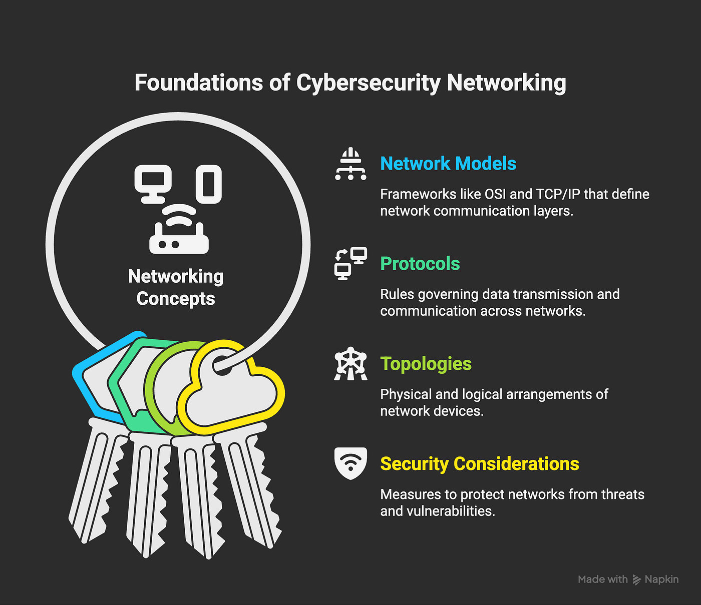
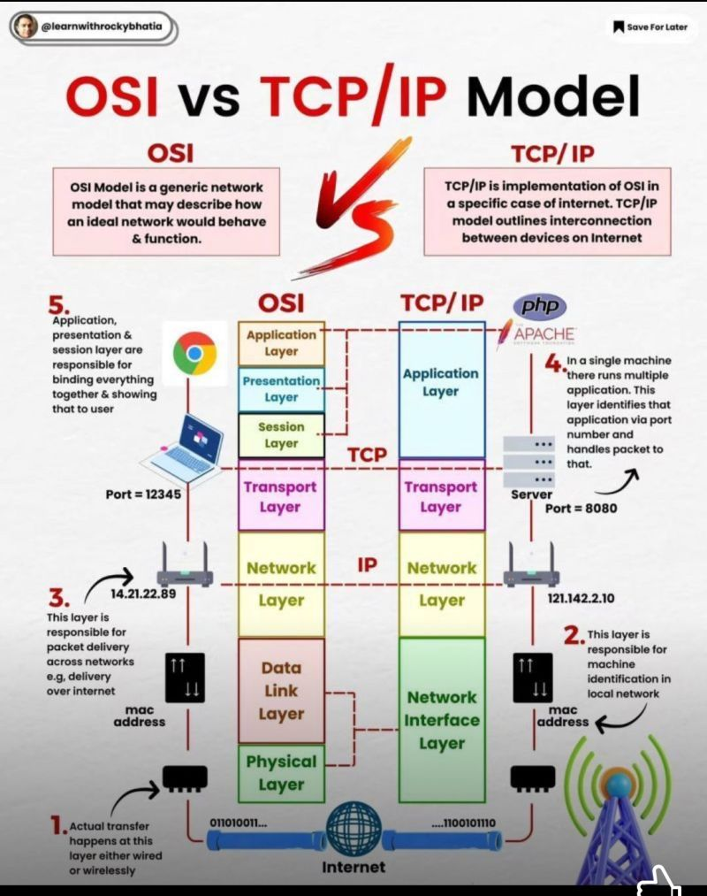
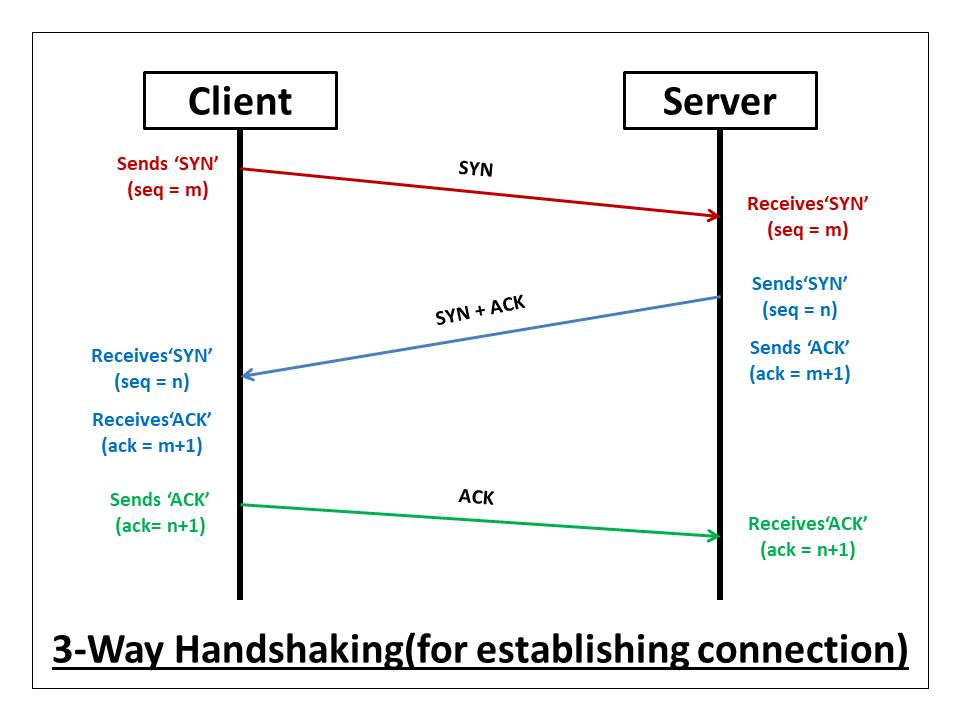
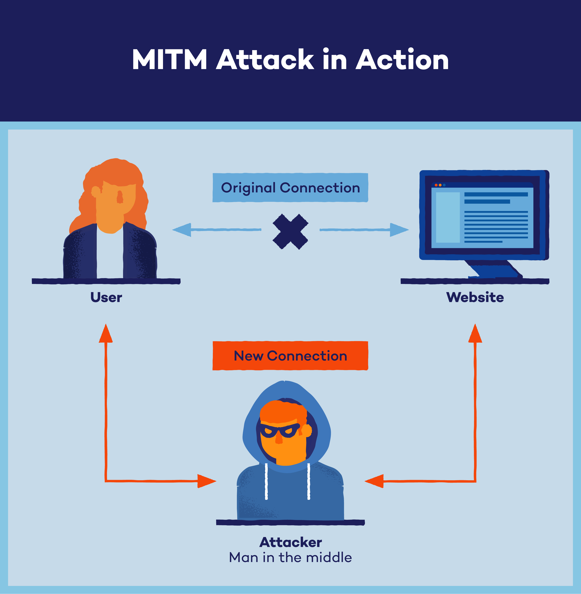
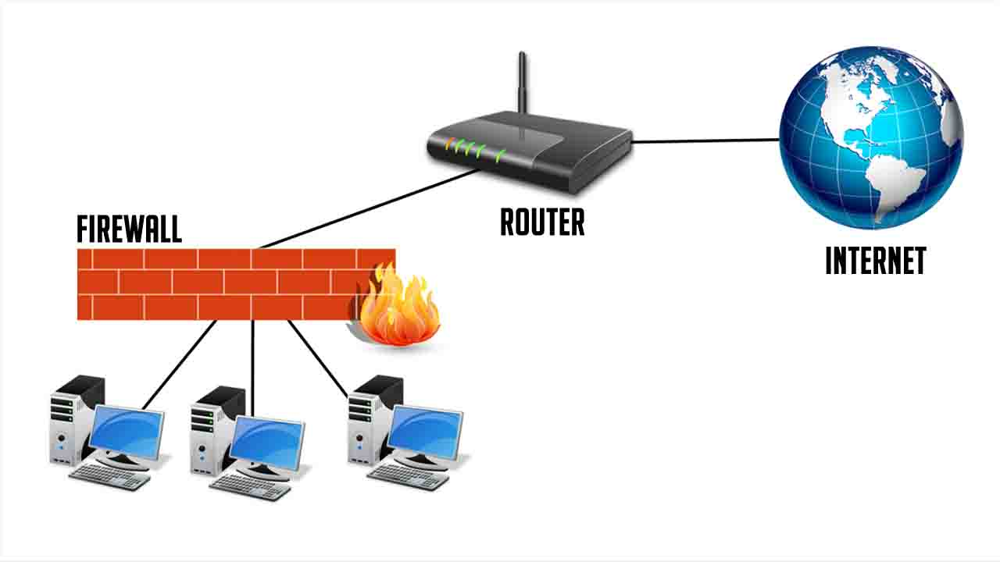

# Task 2: Networking Basics and Protocols

## 1. The OSI Model (Open Systems Interconnection)
The OSI model is a conceptual framework used to understand how data moves across a network. It consists of 7 distinct layers, each serving a specific function.

| Layer Number | Layer Name | Function | Protocol Data Unit (PDU) |
| :--- | :--- | :--- | :--- |
| **7** | **Application** | Direct interaction with software applications (e.g., browsers, email clients). | Data |
| **6** | **Presentation** | Translates, encrypts, and compresses data so the application layer can understand it. | Data |
| **5** | **Session** | Establishes, manages, and terminates communication sessions between devices. | Data |
| **4** | **Transport** | Manages end-to-end communication, flow control, and error detection (TCP/UDP). | Segment (TCP) / Datagram (UDP) |
| **3** | **Network** | Handles routing of data packets across different networks using logical addressing (IP). | Packet |
| **2** | **Data Link** | Provides node-to-node data transfer and handles physical addressing (MAC addresses). | Frame |
| **1** | **Physical** | Transmits raw unstructured bitstreams over a physical medium (cables, radio waves). | Bits |

## 2. TCP/IP Model 
The TCP/IP model is the practical architecture used in the real-world internet today. Unlike the conceptual OSI model, it condenses the networking process into 4 layers.

### Architectural Mapping:
* **Application Layer:** Combines OSI Layers 5, 6, and 7 (Application, Presentation, Session).
* **Transport Layer:** Maps directly to OSI Layer 4 (Transport).
* **Internet Layer:** Maps directly to OSI Layer 3 (Network).
* **Network Access Layer:** Combines OSI Layers 1 and 2 (Physical, Data Link).

## 3. Common Protocols
Protocols are standard sets of rules that allow electronic devices to communicate with each other.

* **HTTP (Hypertext Transfer Protocol) - Port 80:** Used for transmitting web pages across the internet. It sends data in plain text, making it vulnerable to interception.
* **HTTPS (HTTP Secure) - Port 443:** The secure version of HTTP. It uses SSL/TLS encryption to protect sensitive data (like login credentials or credit card numbers) during transit.
* **FTP (File Transfer Protocol) - Ports 20 & 21:** Used for transferring files between a client and a server. Port 21 is used for commands/control, while Port 20 transfers the actual data. Like HTTP, it is unencrypted.
* **SSH (Secure Shell) - Port 22:** Provides a secure, encrypted channel for operating network services and logging into remote servers securely over an unsecured network.
* **DNS (Domain Name System) - Port 53:** The "phonebook of the internet." It translates human-readable domain names (like `google.com`) into computer-readable IP addresses (like `142.250.190.46`).
* **DHCP (Dynamic Host Configuration Protocol) - Ports 67 & 68:** Automatically assigns IP addresses, subnet masks, default gateways, and DNS settings to devices when they connect to a network, eliminating manual configuration.

## 4. IP Addressing & Subnetting Basics

### IP Addressing (IPv4 vs. IPv6)
* **IPv4:** Consists of 32-bit addresses expressed in decimal format (e.g., `192.168.1.1`). It allows for roughly 4.3 billion unique addresses, which are now almost entirely exhausted.
* **IPv6:** Introduced to solve IPv4 exhaustion. It consists of 128-bit addresses written in hexadecimal format (e.g., `2001:0db8:85a3:0000:0000:8a2e:0370:7334`), allowing for virtually infinite address allocations.

### Subnetting Basics
Subnetting is the practice of dividing a single large network into smaller, more manageable, and secure sub-networks (subnets). 
* **Subnet Mask:** A 32-bit number (e.g., `255.255.255.0`) used to separate an IP address into its **Network ID** (which network the device belongs to) and **Host ID** (the specific device on that network).
* **Why Subnet?** It enhances network performance by reducing unnecessary broadcast traffic and significantly improves security by isolating distinct segments of an organization.

## 5. Transmission Control Protocol (TCP) vs. User Datagram Protocol (UDP)
The transport layer relies primarily on these two core protocols.

| Feature | TCP (Transmission Control Protocol) | UDP (User Datagram Protocol) |
| :--- | :--- | :--- |
| **Connection** | Connection-oriented (Requires a 3-way handshake). | Connectionless (Sends data without verifying a link). |
| **Reliability** | Highly reliable; guarantees data delivery and order. | Best-effort; data packets can be lost or arrive out of order. |
| **Speed** | Slower due to overhead, tracking, and error checks. | Exceptionally fast with minimal transmission overhead. |
| **Mechanisms** | Error checking, flow control, and retransmission of lost packets. | Basic error checking; no recovery or tracking mechanisms. |
| **Common Uses** | Web browsing (HTTP/S), Email (SMTP), File transfer (FTP), SSH. | Live video streaming, Online gaming, VoIP, DNS queries. |

### The TCP Three-Way Handshake Workflow
Before TCP transmits any data, it establishes a reliable connection using this process:
1. **SYN (Synchronize):** The client sends a SYN packet to the server to initiate a connection.
2. **SYN-ACK (Synchronize-Acknowledge):** The server responds with a packet confirming receipt and consenting to connect.
3. **ACK (Acknowledge):** The client sends a final confirmation packet back, and the secure data pipeline opens.

## 6. Types of Network Attacks
Cybersecurity professionals must understand basic network vulnerabilities to effectively defend infrastructure.

### A. Man-in-the-Middle (MitM) Attack
A MitM attack occurs when a malicious actor intercepts, alters, or eavesdrops on communication between two legitimate parties who believe they are speaking directly to each other. 
* **Example:** An attacker sitting on an unencrypted public Wi-Fi network intercepting a user's unencrypted HTTP web session to steal their session cookies or passwords.

### B. DNS Spoofing (DNS Cache Poisoning)
DNS Spoofing is an attack where altered DNS records are introduced into a DNS resolver's cache. As a result, the resolver returns an incorrect IP address, rerouting unsuspecting users to a malicious destination website instead of the legitimate one.
* **Example:** A user types `bank.com`, but because the local DNS cache is poisoned, their computer is directed to an IP address hosting a pixel-perfect fake phishing website designed to steal credentials.

### C. ARP Poisoning (Address Resolution Protocol Spoofing)
ARP operates at the Data Link layer to map IP addresses to physical MAC addresses. In an ARP Poisoning attack, a hacker sends fraudulent ARP messages across a local area network (LAN). This associates the attacker's MAC address with the IP address of a legitimate server or the default gateway.
* **Example:** The attacker tricks your computer into believing *they* are the network router, causing all your outbound internet traffic to pass through the attacker's machine first.

## 7. How Firewalls and Routers Work
### Routers
A router operates at **Layer 3 (Network Layer)** of the OSI model. Its primary job is to connect different networks together and route data packets between them using logical IP addresses.
* **How it works:** It maintains a routing table and uses routing algorithms to determine the fastest, most efficient path for a data packet to travel from its source to its destination.

### Firewalls
A firewall is a network security device that monitors and filters incoming and outgoing network traffic based on an organization's previously established security rules. It acts as a barrier between a trusted internal network and untrusted external networks (like the internet).
* **How it works:** It inspects packets against criteria such as source IP, destination IP, protocol type, or port numbers. If a packet matches a block rule (e.g., unauthorized traffic attempting to enter via Port 22), the firewall drops or rejects the packet entirely to protect the internal host.
