# Task 3: Linux Basics for Cybersecurity
A comprehensive guide to essential Linux commands utilized in security operations, system administration and network reconnaissance.

---

## 1. File System Navigation

### 1. pwd (Print Working Directory)
* **Description:** Displays the absolute path of the current working directory.
* **Example Usage:**
    bash: pwd

* **Output:** 
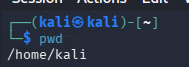

### 2. ls (List Directory Contents)
* **Description:** Lists files and directories. In security, `ls -la` is used to view hidden files (like `.bash_history`) and detailed permissions.
* **Example Usage:**
    bash: ls

* **Output:** 
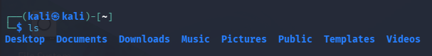

### 3. cd (Change Directory)
* **Description:** Navigates between directories.
* **Example Usage:**
    bash:
    cd Documents

* **Output:** 
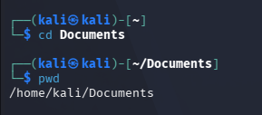

### 4. mkdir (Make Directory)
* **Description:** Creates a new directory. 
* **Example Usage:**
bash: mkdir samplefile
 
* **Output:** 
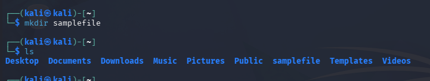

### 5. rm (Remove Files/Directories)
* **Description:** Deletes files or directories. Use `rm -rf` with extreme caution to recursively force-delete.
* **Example Usage:**
bash:
    rm -rf samplefile
   
* **Output:** 
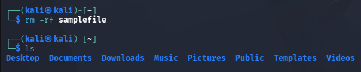

---

## 2. File Permissions

### 6. chmod (Change Mode / Permissions)
* **Description:** Modifies file or directory read, write, and execute permissions. Vital for securing sensitive scripts or configuration files.
* **Example Usage (Giving executable rights to a script):**
bash:
    chmod 755 logs
   
* **Output:** 
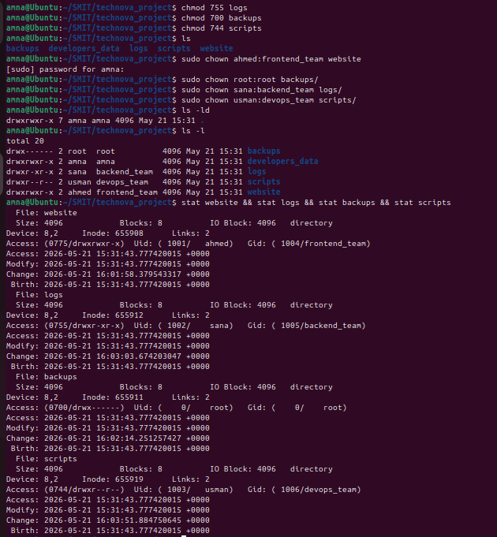

### 7. chown (Change Owner)
* **Description:** Changes the user and/or group ownership of a file.
* **Example Usage (Restricting a file to root):**
bash:
    sudo chown root:root backups/
    
* **Output:** 

---

## 3. User Management

### 8. useradd (Add a New User)
* **Description:** Creates a new local user account with a home directory and password setup configuration.
* **Example Usage:**
bash:
    sudo useradd -m ahmed
    
* **Output:** 
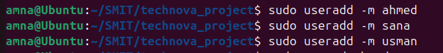

### 9. passwd (Change Password)
* **Description:** Changes a user's password. Used by administrators to enforce credential rotation.
* **Example Usage:**
  bash:
    sudo passwd ahmed
    
* **Output:** 
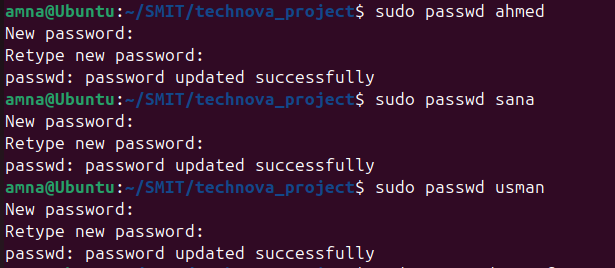

---

## 4. Networking & Reconnaissance

### 10. ifconfig (Interface Configuration)
* **Description:** Displays active network interfaces, IP addresses, MAC addresses, and subnet masks.
* **Example Usage:**
  bash:
    ifconfig
    
* **Output:** 
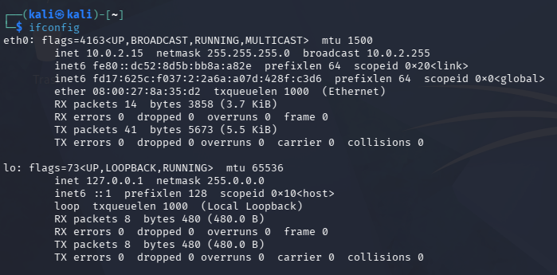

### 11. ping (Packet Internet Groper)
* **Description:** Sends ICMP Echo requests to verify network connectivity and host availability.
* **Example Usage:**
  bash:
    ping google.com
    
* **Output:** 
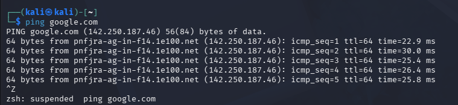

### 12. netstat (Network Statistics)
* **Description:** Displays network connections, routing tables, and interface statistics. Crucial for identifying unauthorized open listening ports (`-tuln`).
* **Example Usage:**
bash:
    netstat -tuln
    
* **Output:** 
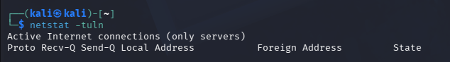

### 13. nmap (Network Mapper)
* **Description:** A premier open-source tool for network discovery and vulnerability scanning.
* **Example Usage (Basic SYN Scan):**
  bash:
    nmap -sS 192.168.1.1
    
* **Output:** 
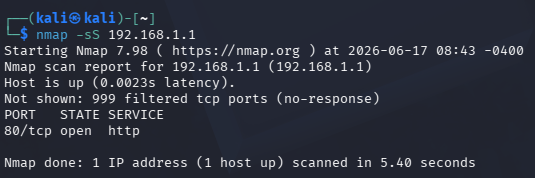

---

## 5. Process Management

### 14. ps (Process Status)
* **Description:** Provides a snapshot of currently running processes. `ps aux` shows all processes running under all users.
* **Example Usage:**
  bash:
    ps aux
    
* **Output:** 
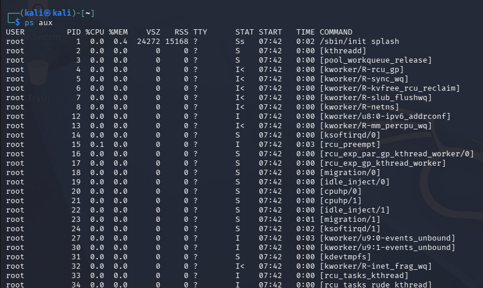

### 15. top (Table of Processes)
* **Description:** Displays a dynamic, real-time view of system processes, CPU, and memory utilization.
* **Example Usage:**
bash:
    top

* **Output:** 
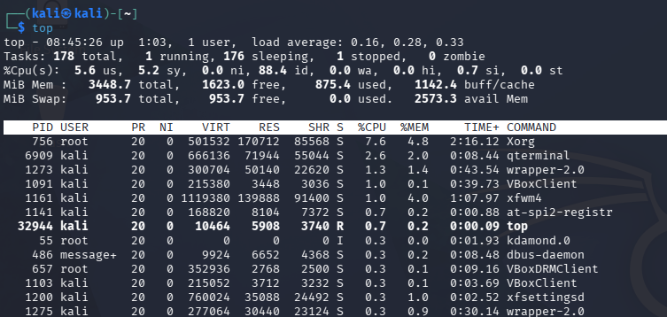

### 16. kill (Terminate Process)
* **Description:** Lists down all the signals or sends a signal (usually `SIGKILL` or `SIGTERM`) to terminate a process via its Process ID (PID).
* **Example Usage:**
bash:
    kill -l
    
* **Output:** 
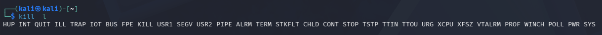

---

## 6. Package Management & Privilege Escalation

### 17. sudo (Superuser Do)
* **Description:** Executes a command with elevated root administrative privileges.
* **Example Usage:**
bash:
    sudo cat /etc/shadow
    
* **Output:** 
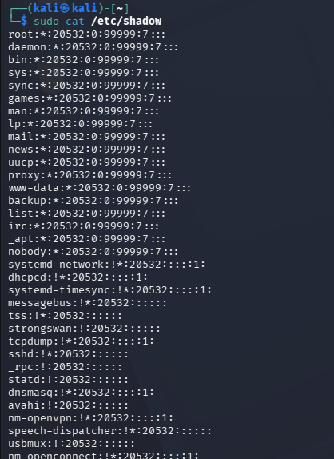

### 18. apt-get update (Update Package Lists)
* **Description:** Resynchronizes package index files from their sources over the internet to ensure tool repositories are current.
* **Example Usage:**
bash:
    sudo apt-get update
    
* **Output:** 
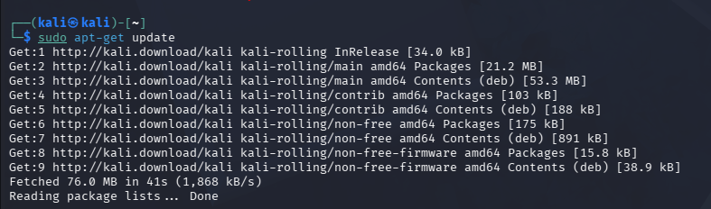

---

## 7. Crucial Cybersecurity Bonus Commands

### 19. cat (Concatenate / View Files)
* **Description:** Used to read file contents instantly. Often used to inspect logs or configuration files.
* **Example Usage:**
bash:
    cat /etc/passwd
    
* **Output:** 
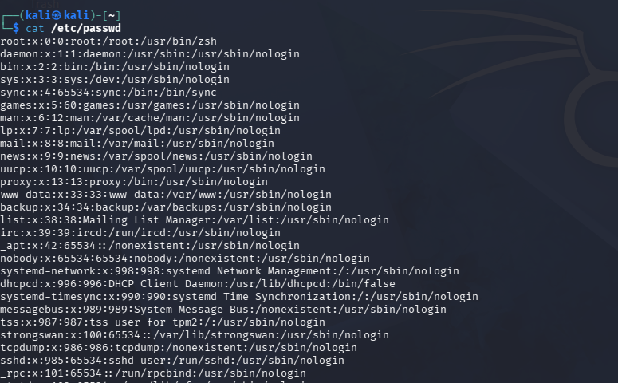

### 20. grep (Global Regular Expression Print)
* **Description:** Filters text or output logs using specific string patterns. Invaluable for parsing massive log files for Indicators of Compromise (IoCs).
* **Example Usage (Searching for failed login attempts):**
bash:
    grep "private" .profile

* **Output:** 
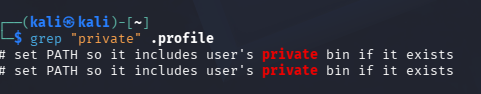
