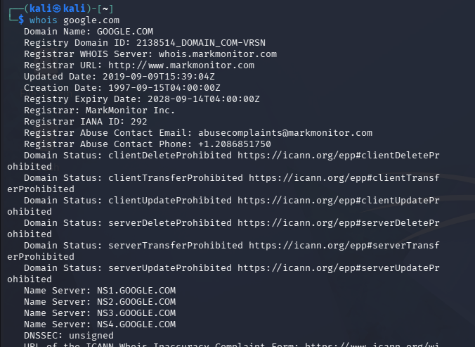
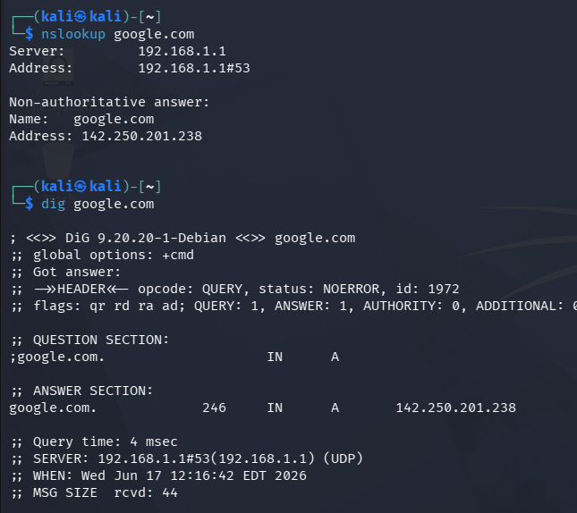
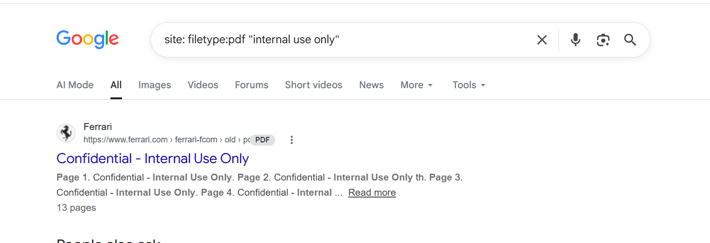

# Task 4: Reconnaissance and Information Gathering

A comprehensive technical report documenting the application of passive and active reconnaissance techniques conducted on authorized and public targets.

---

## 1. Passive vs. Active Reconnaissance

| Feature | Passive Reconnaissance | Active Reconnaissance |
| :--- | :--- | :--- |
| **Interaction** | No direct interaction with the target system. | Direct interaction and data packet exchange with the target. |
| **Detection Risk**| Virtually zero; the target cannot log or detect your activity. | High; activities can be flagged by Firewalls, IDS/IPS, and SIEM tools. |
| **Objective** | Gathering publicly available intelligence (OSINT). | Mapping live infrastructure, open ports, and system vulnerabilities. |
| **Examples** | Google Dorking, WHOIS lookup, Shodan searches, DNS enumeration. | Port scanning (Nmap), banner grabbing, vulnerability scanning. |

---

## 2. WHOIS Lookup

* **Objective:** Query databases to store registered users or assignees of an internet resource (domain name).
* **Target:** `google.com` (Authorized public documentation domain)
* **Command / Tool:**
    bash:
    whois google.com
 
* **Key Findings:** Documented registrar details, creation/expiration dates, and name servers without interacting with the target server hosting the site.

### Output Documentation

---

## 3. DNS Enumeration (`nslookup` & `dig`)

### A. nslookup (Name Server Lookup)
* **Objective:** Query Internet name servers to find the IP address mapping associated with a host.
* **Example Usage:**
   bash:
    nslookup google.com
 

### B. dig (Domain Information Groper)
* **Objective:** A more flexible tool for interrogating DNS name servers, retrieving specific resource records (A, MX, TXT, NS).
* **Example Usage:**
bash:
    dig google.com
    

### Output Documentation

---

## 4. Google Dorking Techniques

Google Dorking utilizes advanced search operators to find security vulnerabilities, exposed files, and sensitive configurations indexed by search engines.

| # | Dork Syntax | Objective / Explanation |
| :--- | :--- | :--- |
| **1** | `filetype:pdf "internal use only"` | Searches for leaked internal PDF documents containing confidential markings. |
| **2** | `site:*.edu intitle:"index of /"` | Identifies exposed directory listings on educational subdomains. |
| **3** | `filetype:sql "password" "wp-config"` | Attempts to find public backups of WordPress databases containing plaintext credentials. |
| **4** | `inurl:login.php` | Restricts search results to application login pages to narrow down authentication entry points. |
| **5** | `intitle:"dashboard" site:example.com` | Checks if a specific target domain exposes administrative dashboards to search indexes. |

### Output Documentation

---

## 5. Shodan Search Concepts

Shodan is a search engine designed to map internet-connected devices (IoT, servers, routers, industrial control systems) rather than web content.

### Crucial Filters Used:
* **`port:21`**: Filters for devices with FTP ports open.
* **`os:"Windows"`**: Filters targets by operating system.
* **`country:"US"`**: Restricts geological telemetry to a specific location.

### Practical Exploration Syntax:
text: 
port:22 country:"US" os:"Windows"

### Output Documentation
