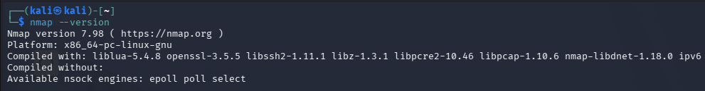
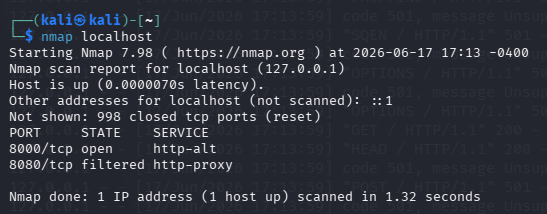
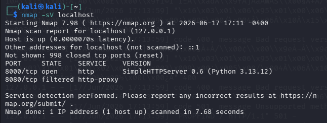
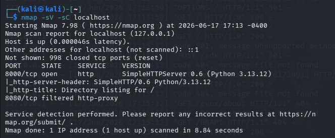
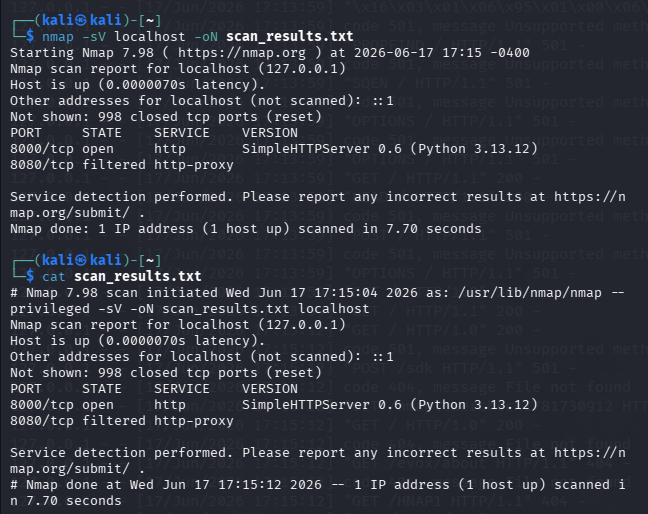

# Task 5: Vulnerability Scanning and Analysis

## Objective

The objective of this task is to understand vulnerability scanning concepts, perform network scanning using Nmap, use Nmap Scripting Engine (NSE) for service detection, study the Common Vulnerabilities and Exposures (CVE) system, understand CVSS scoring, and create a vulnerability scan report template.

---

## What is Vulnerability Scanning?

Vulnerability scanning is the automated process of identifying security weaknesses, exposed services, misconfigurations, and known vulnerabilities within systems, networks, or applications.

Security teams use vulnerability scanners to discover potential attack vectors before malicious actors can exploit them.

---

## Importance of Vulnerability Scanning

Vulnerability scanning is important because it:

* Identifies security weaknesses early.
* Helps reduce organizational risk.
* Detects outdated software and services.
* Supports compliance requirements.
* Improves overall cybersecurity posture.
* Assists administrators in prioritizing remediation efforts.

---

## Tools Used

* Nmap (Network Mapper)
* Kali Linux
* GitHub

---

# Nmap Installation Verification

Command:

```bash
nmap --version
```

Screenshot:



---

# Basic Port Scan

Command:

```bash
nmap localhost
```

Purpose:

This scan identifies open ports and services running on the target machine.

Screenshot:



---

# Service Detection Scan

Command:

```bash
nmap -sV localhost
```

Purpose:

The `-sV` option enables service version detection and attempts to identify software versions running on open ports.

Screenshot:



---

# NSE Script Scan

Command:

```bash
nmap -sV -sC localhost
```

Purpose:

The `-sC` option runs default Nmap Scripting Engine scripts to gather additional information about discovered services.

Screenshot:



---

# Saving Scan Results

Command:

```bash
nmap -sV localhost -oN scan_results.txt
```

Purpose:

Stores scan results in a text file for future analysis and reporting.

Screenshot:



---

# Understanding CVE

CVE stands for Common Vulnerabilities and Exposures.

It is a standardized system used to identify publicly known cybersecurity vulnerabilities. Each vulnerability receives a unique identifier such as:

```text
CVE-2021-44228
```

The CVE system helps security professionals consistently reference vulnerabilities across different tools and vendors.

---

# Understanding CVSS

CVSS (Common Vulnerability Scoring System) is used to measure the severity of vulnerabilities.

| Score Range | Severity |
| ----------- | -------- |
| 0.0         | None     |
| 0.1 - 3.9   | Low      |
| 4.0 - 6.9   | Medium   |
| 7.0 - 8.9   | High     |
| 9.0 - 10.0  | Critical |

Organizations use CVSS scores to prioritize remediation efforts.

---

