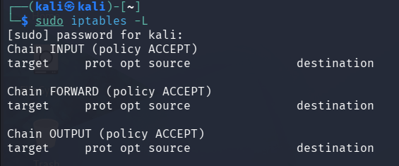
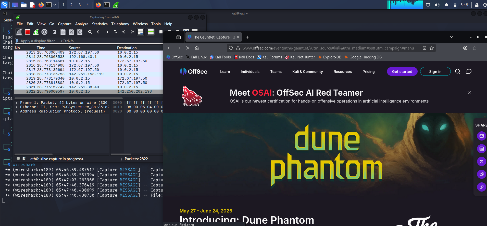
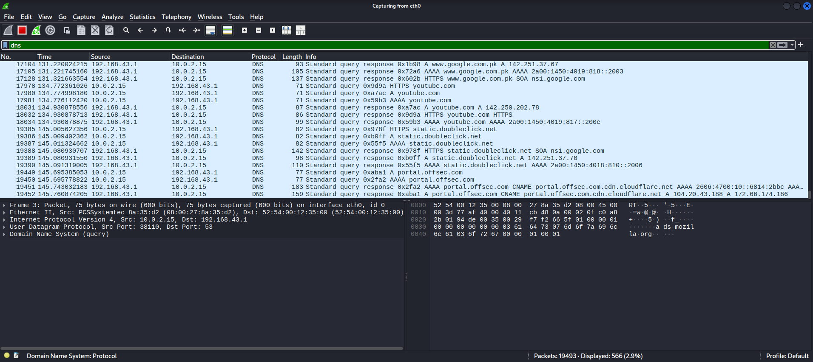

# Task 8 - Network Security and Firewall Configuration

## Objective

The objective of this task is to learn network security concepts, understand firewall technologies, configure basic firewall rules using iptables, study IDS and IPS systems, understand VPN security, perform packet analysis using Wireshark, identify suspicious traffic patterns, and develop a network security policy for CoreTech Innovation.

---

# 1. Introduction to Network Security

Network security refers to the protection of network infrastructure, devices, and data from unauthorized access, attacks, misuse, and disruption.

The primary goals of network security are:

* Confidentiality
* Integrity
* Availability

These goals ensure that information remains secure and accessible only to authorized users.

---

# 2. Types of Firewalls

## Packet Filtering Firewall

A packet filtering firewall examines network packets based on predefined rules such as:

* Source IP Address
* Destination IP Address
* Protocol Type
* Port Number

### Advantages

* Fast processing
* Low resource usage

### Disadvantages

* Limited inspection capabilities
* Cannot analyze application data

---

## Stateful Firewall

A stateful firewall tracks active network connections and makes filtering decisions based on connection state information.

### Advantages

* More secure than packet filtering
* Understands established connections

### Disadvantages

* Higher memory and CPU usage

---

## Application Layer Firewall

An application layer firewall inspects traffic at the application layer and understands protocols such as HTTP, HTTPS, FTP, and SMTP.

### Advantages

* Deep packet inspection
* Better protection against application attacks

### Disadvantages

* Slower processing
* Resource intensive

---

# 3. Firewall Configuration Using iptables

iptables is a Linux firewall utility used to define rules for incoming and outgoing network traffic.

## Viewing Existing Rules

Command:

```bash
sudo iptables -L
```

Screenshot:



---

## Allowing SSH Traffic

Command:

```bash
sudo iptables -A INPUT -p tcp --dport 22 -j ACCEPT
```

Explanation:

* INPUT = incoming traffic
* tcp = TCP protocol
* dport 22 = SSH port
* ACCEPT = allow traffic

Screenshot:


---

## Blocking Telnet Traffic

Command:

```bash
sudo iptables -A INPUT -p tcp --dport 23 -j DROP
```

Explanation:

* Port 23 is used by Telnet
* Telnet is considered insecure because traffic is transmitted in plaintext

Screenshot:


---

# 4. IDS and IPS Systems

## Intrusion Detection System (IDS)

An IDS monitors network traffic and generates alerts when suspicious activity is detected.

Examples:

* Snort
* Suricata
* Zeek

### Functions

* Detect attacks
* Generate alerts
* Monitor network activity

---

## Intrusion Prevention System (IPS)

An IPS not only detects malicious activity but also actively blocks it.

### Functions

* Detect attacks
* Block malicious traffic
* Prevent exploitation attempts

---

## Snort

Snort is an open-source IDS/IPS capable of:

* Real-time traffic monitoring
* Protocol analysis
* Content searching
* Threat detection

---

## Suricata

Suricata is a modern open-source IDS/IPS engine.

Features:

* Multi-threaded architecture
* High-speed traffic inspection
* Deep packet analysis
* Protocol detection

---

# 5. Virtual Private Network (VPN)

A Virtual Private Network (VPN) creates an encrypted tunnel between a user and a remote network.

## Benefits of VPN

* Encrypts network traffic
* Protects user privacy
* Secures communication on public Wi-Fi
* Hides browsing activity from attackers

## How VPN Protects Traffic

Without VPN:

User → Internet → Destination

Traffic can potentially be intercepted.

With VPN:

User → Encrypted Tunnel → VPN Server → Destination

Traffic remains encrypted while traveling through the network.

---

# 6. Wireshark Packet Analysis

Wireshark is a network packet analyzer used to inspect and analyze network traffic.

## Capturing Packets

Steps performed:

1. Opened Wireshark.
2. Selected active network interface.
3. Started packet capture.
4. Generated traffic by browsing websites.
5. Stopped capture.

Screenshot:



---

## DNS Traffic Analysis

Filter used:

```text
dns
```

Screenshot:



DNS packets reveal domain name resolution requests between clients and DNS servers.

---

# 7. Suspicious Traffic Patterns

Common suspicious network behaviors include:

## Port Scanning

Characteristics:

* Multiple connection attempts
* Sequential destination ports
* Rapid traffic generation

Tools commonly used:

* Nmap

---

## Excessive DNS Requests

Characteristics:

* Large number of DNS queries
* Unusual domain names
* Potential command-and-control communication

---

## Repeated Failed Connections

Characteristics:

* Continuous connection attempts
* Brute-force attack indicators

---

## Traffic Spikes

Characteristics:

* Sudden increase in network activity
* Possible denial-of-service attacks

---

# 8. Network Security Policy for CoreTech Innovation

## Purpose

To establish security controls that protect CoreTech Innovation's network infrastructure and information assets.

---

## Access Control Policy

* Access shall be granted based on business requirements.
* Users must use unique credentials.
* Shared accounts are prohibited.

---

## Password Policy

* Minimum length: 8 characters
* Combination of letters, numbers, and symbols
* Passwords must be changed periodically

---

## Firewall Policy

* Only required ports shall remain open.
* Unused services shall be disabled.
* Firewall rules shall be reviewed regularly.

---

## Remote Access Policy

* VPN must be used for remote access.
* Public Wi-Fi access must use encrypted connections.

---

## Monitoring Policy

* Network logs shall be reviewed regularly.
* IDS/IPS alerts shall be investigated promptly.

---

## Software Update Policy

* Operating systems must be updated regularly.
* Security patches shall be applied as soon as practical.

---

## Incident Response Policy

In the event of a security incident:

1. Identify the threat.
2. Contain affected systems.
3. Investigate the incident.
4. Recover services.
5. Document lessons learned.

---


